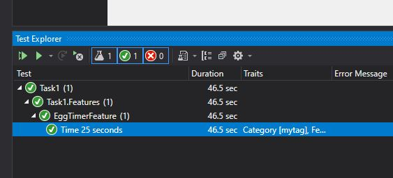

# Timer egg test

This project is to test the operation of the countdown functionality on the [http://e.ggtimer.com/](http://e.ggtimer.com/) website.


### Prerequisites

You will need at least v3.1 of the ASP.NET Core SDK

* [.NET Core >3.1](https://dotnet.microsoft.com/download)
```
Some development IDE, e.g Visual Studio
```
## Platform
Windows or Linux as long as the .net Core runtime is installed

## Dependencies
All dependencies are resolved from Nuget during build

### Installing

A step by step series of examples that tell you how to get this test running locally, for these example steps, we're assuming Windows running Visual Studio 2019 or later

* Download this repository locally
* Open in IDE
* Build the project by pressing F6 or selecting *Build\Build Solution* in the top navigation
* Open up the Test Explorer (*Test\Test Explorer*)
* Select *run all tests in view* you should receive the following output




If any of the tests fail, or you want a breakdown of steps, click on the *Open additional output for this result* to display the details of the individual steps


### Coding style

Coding guidelines, are default Resharper recomendations.

## Deployment

* Commit to GIT, latest version is used on each Jenkins build

## Built With

* [.NET Core >3.1](https://dotnet.microsoft.com/download)
* Selenium Web driver (chrome in the example)
* Gherkin Design Pattern - Given , When , Then Approach to write Test Scripts

## Highlights
The test utilizes a single scenario with multiple then steps, I believed this to be the right approach to reduce the number of runs required to store the data used to test all the functionality, and also because it was a single scenario under test.

## Improvements
You may want to inject the list of browsers to test on via your pipeline.
Add Multilingual support to test in other languages when available.

## Contributing

Please follow normal Git branching strategy, with a new branch for each feature

## Versioning

no tagging strategy defined

## Authors

* **Mark Richardson** - *Initial work* - [Tridion Ted](https://twitter.com/tridionted)


## License

This project is closed source.

